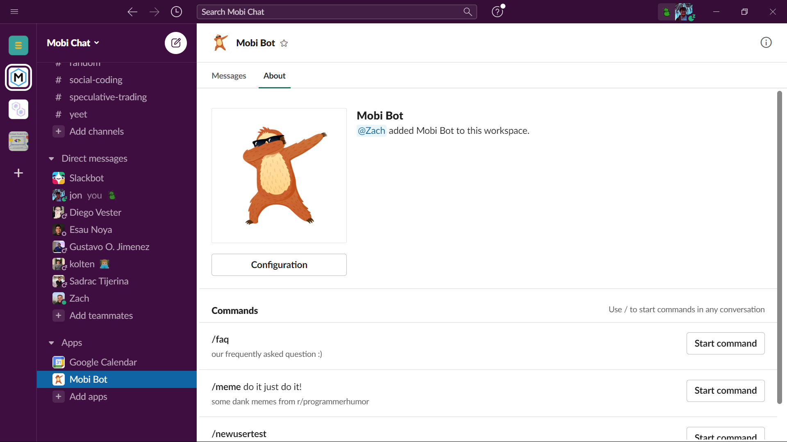
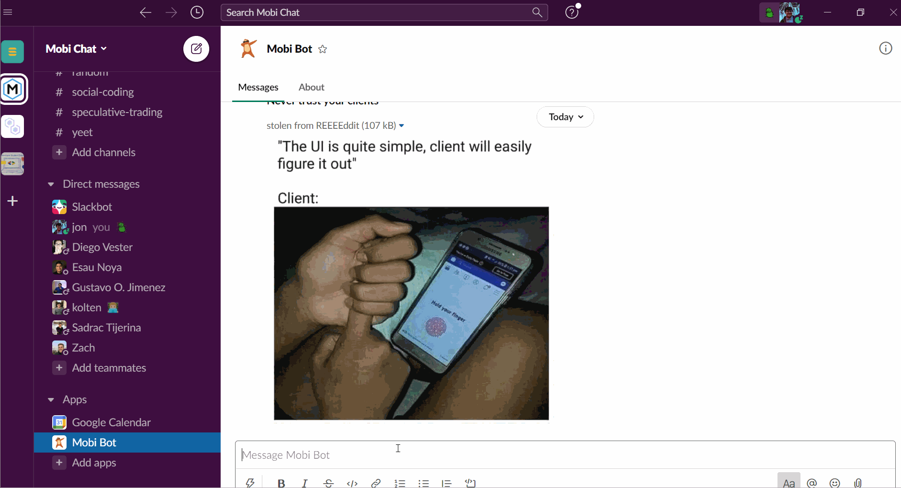

<!-- PROJECT SHIELDS -->
[![MIT License][license-shield]][license-url]
[![LinkedIn][linkedin-shield]][linkedin-url]

<!-- PROJECT LOGO -->
<p align="center">
  <a href="https://github.com/jonathanpv/mobi-slack-bot">
    
  </a>

  <h3 align="center">Mobi Slack Bot</h3>

  <p align="center">
    A slack extension for Mobi with custom built functions to help with new member onboarding and engagement
    <br />
    <a href="#docs"><strong>Explore the docs »</strong></a>
    <br />
    <br />
    <a href="https://github.com/jonathanpv/mobi-slack-bot">View Demo</a>
    ·
    <a href="https://github.com/jonathanpv/mobi-slack-bot/issues">Report Bug</a>
    ·
    <a href="https://github.com/jonathanpv/mobi-slack-bot/issues">Request Feature</a>
  </p>
</p>


<!-- TABLE OF CONTENTS -->
<details open="open">
  <summary>Table of Contents</summary>
  <ol>
    <li>
      <a href="#about-the-project">About The Project</a>
      <ul>
        <li><a href="#built-with">Built With</a></li>
      </ul>
    </li>
    <li>
      <a href="#getting-started">Getting Started</a>
      <ul>
        <li><a href="#prerequisites">Prerequisites</a></li>
        <li><a href="#installation">Installation</a></li>
      </ul>
    </li>
    <li><a href="#docs">Docs</a></li>
    <li><a href="#contributing">Contributing</a></li>
    <li><a href="#license">License</a></li>
    <li><a href="#contact">Contact</a></li>
  </ol>
</details>

<!-- ABOUT THE PROJECT -->
## About The Project

During a session of [social coding](https://utamobi.com/pages/SocialCoding.html) Zach started setting up a slack bot on Glitch so we could all
code a few fun messages and get an introduction to Javascript, after a few days I found myself being the most active on the fun project and decided
to expand and deliver a few features.

<p align="center">
  <a href="https://github.com/jonathanpv/mobi-slack-bot">
    
  </a>
</p>

### On the Front-End
- we don't have one but if you want to make one just create the files `public/client.js`, `public/style.css` and `views/index.html` and hack away!
- drag in `assets`, like images or music, to add them to your project

### On the Back-End
- your app starts at `server.js`
- add frameworks and packages in `package.json` these packages are usually found in npm
- safely store app secrets in `.env` (nobody can see this but you and people you invite) plz no dox
- we use axios for get requests
- mongodb is used for a database why? because mongo sounds like mango
- we tried keeping things neat by keeping things seperated which is why there's `src/channel-id.js` and more
- look at some of the examples on `src/server.js` if you need help ping us on slack! hope you have fun and learn! :)

### Feature Overview
* Members can easily access Mobi's frequently asked questions through a command
* Browse the top posts of Reddit's r/programmerhumor within Slack 
* When members join, Mobi bot greets them with a random message from a list of templates in welcome-messages.js
* Channel moderators can test what a new user onboarding is with /newusertest
* Fun commands to keep members engaged and eager to program their own commands! 
    * such as ``translateto dothraki`` to translate your message to dothraki 
    * ``$STOCK_TICKER_SYMBOL`` to retrieve a current price and volume information of a specified stock 
    * ``show me a cat fact`` to display a random cat fact 
    * ``And many more to come!`` 

### Project Goal
The aim of this project was to create something useful for new members and be able to onboard them to Mobi and help them learn some Javascript along
the way, and hopefully getting them excited about hacking their own features!

For more information on how to add your own feature keep reading!

### Built With

This section should list any major frameworks that you built your project using. Leave any add-ons/plugins for the acknowledgements section. Here are a few examples.
* [Glitch](https://glitch.com/)
* [Slack Bolt Javascript](https://slack.dev/bolt-js/concepts)
* [NodeJS](https://nodejs.org/en/)
* [Fun APIs we found from Google, here's a neat article of some](https://dev.to/biplov/15-fun-apis-for-your-next-project-5053)

### Glitch
Glitch is the friendly community where you'll build the app of your dreams. Glitch lets you instantly create, remix, edit, and host an app, bot or site, and you can invite collaborators or helpers to simultaneously edit code with you.

Find out more [about Glitch](https://glitch.com/about).

<!-- GETTING STARTED -->
## Getting Started

The exact instructions might have changed since the project started but the below steps should help with initial setup!

### Prerequisites
Setup an account with Glitch and create your first project, if you're completely new to Glitch check out [this great article to get ramped up](https://medium.com/glitch/welcome-to-glitch-fe161d0fc39b)! \
Set up your first Slack app with Glitch [by following these steps](https://dreisbach.us/articles/build-slackbot-glitch/)

### Installation

1. [Clone the repo onto a new Glitch project](https://medium.com/glitch/import-code-from-anywhere-83fb60ea4875#:~:text=To%20do%20so%2C%20select%20the,and%20the%20full%20commit%20history.)
   ```sh
   git clone https://github.com/jonathanpv/mobi-slack-bot.git
   ```
2. Go through the same steps in the prerequisites but now connect your slack server's tokens by modifying the environment variables in your project
3. Great success! 

<!-- USAGE EXAMPLES -->
## Docs

Use this space to show useful examples of how a project can be used. Additional screenshots, code examples and demos work well in this space. You may also link to more resources.
| Command | Description |
| --- | --- |
| /faq | List most frequently asked questions along with their answers |
| /meme | Display a top daily post from r/programmerhumor from reddit |
| translateto dothraki ``<message>`` | Translates ``message`` to dothraki! |
| newusertest | Displays the message a new user would receive from Mobi Bot when new user joined team event is triggered |
| cat | Mentioning cat in your message sends a random cat fact, along with an image of one! 🤩|
| oof | Mentioning oof in your message will cause Mobi bot to oof alongside with you, namely Mobi bot will return a **big oof** |
| yeet | Mobi bot shall YAW |
| wutang ``<name>`` | Converts ``name`` into a wutang name |
| rip | Mobi bot will reply "😔 rip" |
| f in the chat | Mobi bot will reply with our own custom f emoji |
| hello | Mobi bot will greet you! You're never alone when in the Slack, Mobi bot will always be there for you 😃 |
| goose coin | Mobi bot will return an image of goose coin, a meme slightly popular in 2018 lol |
| random doge | Mobi bot will search the internet for a random image of a doge and deliver it to you, perfect for the #dog channel |
| $``<stock ticker symbol>`` | Mobi bot returns the recent volume and price of the ``stock ticker symbol`` specified |
| Your feature here | What are you wating for, fellow hacker, come build your own feature and submit a pull request! |

<!-- CONTRIBUTING -->
## Contributing

Contributions are what make the open source community such an amazing place to be learn, inspire, and create. Any contributions you make are **greatly appreciated**.

1. Fork the Project
2. Create your Feature Branch (`git checkout -b feature/AmazingFeature`)
3. Commit your Changes (`git commit -m 'Add some AmazingFeature'`)
4. Push to the Branch (`git push origin feature/AmazingFeature`)
5. Open a Pull Request

<!-- LICENSE -->
## License

Distributed under the MIT License. See `LICENSE` for more information.

## Demo
Below is a gif deomnstrating the commands and the responses mobi bot has for them, although it shows the channel being in a dm with the bot these messages also work in public and private channels since the bot can listen to events server-wide

<div class="crop-gif" style="width: 800px; height: 450px; overflow: hidden; align: center; margin: auto;">
    
</div>

<!-- CONTACT -->
## Contact

Jonathan Padilla - [linkedin](https://linkedin.com/in/jonathanpv) \
Project Link: [https://github.com/jonathanpv/mobi-slack-bot](https://github.com/jonathanpv/mobi-slack-bot) \
Mobi UTA: [Homepage](https://utamobi.com/index.html)

Made by [Mobi](https://utamobi.com/)
-------------------

<center>
🎉 Thanks for checking out my project! 🎉

\ ゜o゜)ノ
</center>


[license-shield]: https://img.shields.io/github/license/jonathanpv/mobi-slack-bot?style=for-the-badge
[license-url]: https://github.com/jonathanpv/mobi-slack-bot/blob/main/LICENSE
[linkedin-shield]: https://img.shields.io/badge/-LinkedIn-black.svg?style=for-the-badge&logo=linkedin&colorB=555
[linkedin-url]: https://linkedin.com/in/jonathanpv
